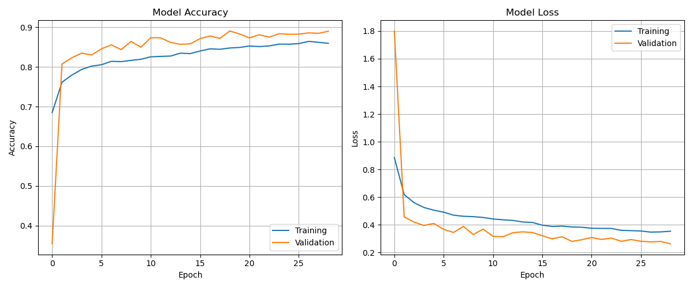

# Closet Scan

[](https://github.com/dorothysheng/closet-scan-image-process)

## 🔍 Overview

Closet Scan is an AI-powered clothing digitization system that processes photos of clothing into 3D textures and maps them to pre-made 3D models. The pipeline categorizes clothing items (T-shirt/top, Trouser, Dress, Coat, Shirt) and applies the extracted textures to the appropriate 3D model. This repository contains the complete machine learning pipeline that powers the clothing digitization process for the Closet Scan application.

## ⚙️ Environment Setup
1. Clone the repository:
   ```bash
   git clone https://github.com/dorothysheng/closet-scan-image-process.git
   cd closet-scan-image-process
   ```

2. Create and activate the conda environment:
   ```bash
   conda env create -f environment.yml
   conda activate closet
   ```

3. Verify the installation:
   ```bash
   python -c "import torch, cv2, numpy; print('Setup successful!')"
   ```


## 📂 Directory Structure

Ensure you have the following directory structure for data processing:

```
closet-scan-image-process/
├── images/                      # Data directory
│   ├── raw/                     # Original unmodified images
│   ├── processed/               # Processed images by step
│   │   ├── step1_remove_background/  # Background-removed images
│   │   ├── step2_classification/     # Classified images
│   │   ├── step3_texture/            # Extracted textures
│   ├── output/                  # Final outputs
```

Create the required directories with:
```bash
mkdir -p images/raw images/processed/step1_remove_background images/processed/step2_classification images/processed/step3_texture images/output
```

## 🚀 Pipeline Steps

### 1. Background Removal

```bash
# Process a single image
python step1_remove_background.py images/raw/raw1.jpg

# Process an entire directory
python step1_remove_background.py images/raw/

# Use clothing-optimized model
python step1_remove_background.py images/raw/raw1.jpg --model u2net_cloth_seg
```
<div align="center">
  
  
  <p><em>Original image (left) and background removed (right)</em></p>
</div>

**Output:** `images/processed/step1_remove_background/`

### 2. Clothing Classification

```bash
# Navigate to the step2-categorize directory
cd step2-categorize

# Train the classification model
python train.py

# Classify a single image
python predict.py path/to/your/image.jpg

# Process all images in a directory
python predict.py images/processed/step1_remove_background/
```

The classification model identifies clothing items in 5 categories:
- T-shirt/top
- Trouser
- Dress
- Coat
- Shirt

<div align="center">
  
  <p><em>Background-removed image (left) and extracted texture (right)</em></p>
</div>

**Output:** `images/processed/step2_classification/`

### 3. Texture Extraction

```bash
# Basic usage
python step3_texture.py images/processed/step1_remove_background/raw1.png

# Process all images in a directory
python step3_texture.py images/processed/step1_remove_background/

# Customize texture generation
python step3_texture.py images/processed/step1_remove_background/raw1.png --size 2048 --seamless --density 0.8

# Control stamp sizes
python step3_texture.py images/processed/step1_remove_background/raw1.png --min-stamp 200 --max-stamp 600

# Customize output size and make seamless
python step3_texture.py images/processed/step1_remove_background/raw1.png --size 2048 --seamless --enlarge 1.5
```

**Output:** `images/processed/step3_texture/`
<div align="center">
  
  
  <p><em>Input image (left) and extracted texture (right)</em></p>
</div>

## Key Features

### 1. Intelligent Background Removal
- AI-powered background removal using U2Net models
- Specialized clothing segmentation model option
- Preserves fine details like straps and lace

### 2. Clothing Classification
- Identifies clothing categories from photos (T-shirt/top, Trouser, Dress, Coat, Shirt)
- Uses CNN architecture trained on Fashion MNIST dataset
- Achieves ~85-90% accuracy on test data
- Supports real-world clothing photos

### 3. Advanced Texture Extraction
- Extracts fabric patterns as stamps with feathered edges
- Creates natural-looking textures by intelligently placing stamps
- Preserves original image details while filling transparent areas
- Creates seamlessly tileable textures
- Edge shrinking to remove dark borders

### 4. 3D Model Integration
- Maps textures to pre-made 3D models
- Handles various clothing types (tops, bottoms, dresses)
- Optimized for real-time rendering in Unity/Unreal

## 🔧 Technical Details

### Model Architecture
- **Background Removal**: U2Net and U2Net_cloth_seg models
- **Clothing Classification**: CNN with convolutional layers, batch normalization, max pooling, and dropout
- **Texture Extraction**: Custom stamp-based pattern extraction with feathered edges and intelligent placement algorithms

### Training Data
- Fashion MNIST dataset (baseline)
- Custom dataset of real clothing photos
- Augmented with various lighting and perspective variations

## 🌐 API Integration

The project includes a FastAPI-based REST API for integration with Unity and Unreal Engine:

```bash
# Start the API server
python api\closet_api.py
```

### Available Endpoints

| Endpoint | Method | Description |
|----------|--------|-------------|
| `/process_image` | POST | Complete pipeline processing |
| `/remove_background` | POST | Background removal only |
| `/extract_texture` | POST | Texture extraction only |


